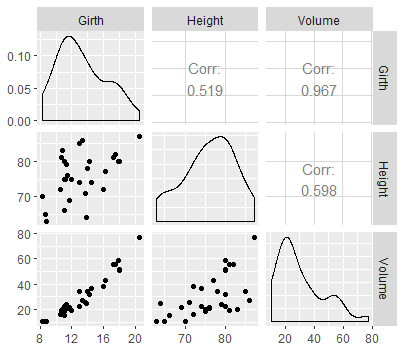
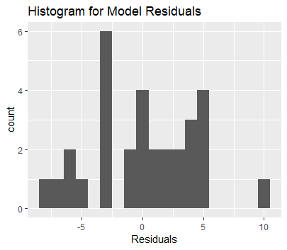
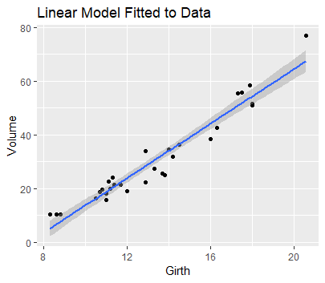

# Predictive Modeling using Linear Regression in R
Statistics has an important role in Informatics. It is used to draw conclusions from data. More often than not we have to predict statistics from existing data, that is where Linear Regression comes in.

## What is Linear Regression?

A linear regression is a statistical model that analyzes the relationship between a response variable (often called y) and one or more variables and their interactions (often called x or explanatory variables).

## Let's get into it!

The data set I will use to demonstrate the use of linear regression is the 'trees' dataset in the base R's dataset package.

`
data(trees) ## access the trees package
`
 
`
View(trees) ## to look at the rows and columns of the dataset
`

You can see that this dataset contains 31 observations with 3 variables measuring tree trunks
- Girth(in)
- Height(ft)
- Volume(ft3)

First off we have to see if there is a relation between our variables, since we have only 3 variables to compare this shouldn't be so hard. This is where R is extremely useful- we will create a plot matrix of graphs to see how the variables relate to one another.

`
GGally::ggpairs(data=trees)
`

This renders a graph which looks like this:

The correlation coefficients (_Corr_ on the graph) is a measure of how strongly related the variables are. The closer the value is to 1, the stronger the correlation is. The more the cloud of points resemble a line, the closer the correlation coefficients is near 1, the stronger the correlation is.

Note: negative correlation coefficient means the variables are inversely related

From these graphs we can infer
- Girth seems to be related to volume: as girth increases, so does volume
- Height seems to be related volume, though there is a weak correlation

### Statistical Analysis

Null Hypothesis(H0): There is no correlation between girth and volume
Alternate Hypothesis(Ha): There is no correlation between girth and volume

We will use linear regression to test our null hypothesis. If we strong enough evidence to reject it in favour of the alternate hypothesis, we will use it to predict a the volume of a tree using its Girth

#### Lets build the linear model!

`
linear_model <- lm(Volume ~ Girth, data = trees)
`

What this does is uses our 31 observations and draws a "line of best fit"  which is a line that is the closest to all of the observations.
This line is close to most data points, but doesn't contain all of them, the distance between the point and the predicted point on the line is called *residual*
This line will have formula which can be calculated from slope-intercept form of line:  
`
Volume = Slope(Girth) + Intercept + Error
`

Note: I will not include definitions of statistical models used, to get more information, you can simply use google!

| Question                              | Stats Used                                       | Significance                                                                        |
|---------------------------------------|--------------------------------------------------|-------------------------------------------------------------------------------------|
| How well does the model fit the data? | Median, Upper and Lower Quartiles, Min and Max   | Shows the distribution of data, particularly in the form of boxplots                |
| Is the hypothesis supported?          | Estimated Standard Deviation, Error and t values | Here t value is evidence of a significant difference between population means       |
| How well does the model fit the data? | Residual Standard Error, p value                 | A small p value(smaller than 0.1) indicates strong evidence against null hypothesis |

To answer these questions we can use the R function  
`
summary(linear_model)
`
this generates:

We can create visualizations to see the trends of residual values

`
ggplot(data=trees, aes(linear_model$residuals)) +
  geom_histogram(binwidth = 1) +
  labs( title = "Histogram for Model Residuals", x = "Residuals")
`

Our residuals look pretty symmetrical around 0, suggesting that our model fits the data well.

#### Finally! The linear model

`
ggplot(data = trees, aes(x = Girth, y = Volume)) + geom_point() +
  stat_smooth(method = "lm") +
  ggtitle("Linear Model Fitted to Data")
`

- The grey shading represents a confidence interval of 95%, that is we ae 95% sure that the line lies within the shaded area
- Even though this is the line of best fit, there is variability because we live in an imperfect world and there are other factors that may contribute to the girth of the trees

## Making Predictions

Let's say we have a random tree with the following measurements:

| Girth       | Height | Volume              |
|-------------|--------|---------------------|
| 18.2 inches | 72 ft  | 46.2 ft3 |

Now we will see how well our model predicts the volume of this tree  

`
predict(linear_model, data.frame(Girth = 18.2), se.fit = TRUE)
`
 Here, se.fit indicates if standard errors are required.

### Our volume prediction is 55.2 ft3
This value is close to the actual value, but not exact. Perhaps adding more values to our linear model would make the predicted value closer to the actual value.

I suggest playing around with the relations of the variables

You could try:
`
linear_model2 <- lm(Volume ~ Girth * Height, data = trees)
`
 "Girth \* Height" term is shorthand for "Girth + Height + Girth \* Height" in our model.
  You can use scatterplot 3d to plot graphs for this since we have three variables.

### From this linear model we get our predicted value as 45.8 ft3
This is much closer to the actual value, which makes our linear regression successful!

Citations:
- “Linear Regression R.” DataCamp Community, www.datacamp.com/community/tutorials/linear-regression-R.
- Martin, Rose. “Using Linear Regression for Predictive Modeling in R.” Dataquest, Dataquest, 12 Nov. 2018, www.dataquest.io/blog/statistical-learning-for-predictive-modeling-r/.
